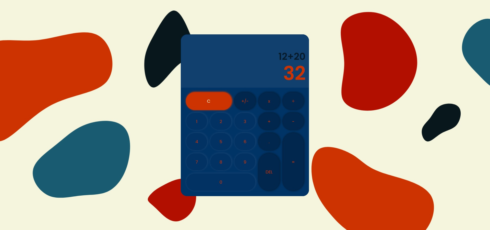

# Calculator

This is a calculator created with JavaScript, HTML and SCSS. 

It can do simple operations between two numbers.

## Instructions
* to open the calculator click here: https://tea-milas.github.io/calculator/  
* input a number  -> press the operator --> input another number --> press equals
